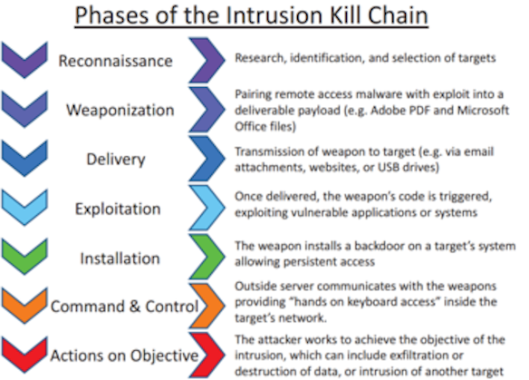
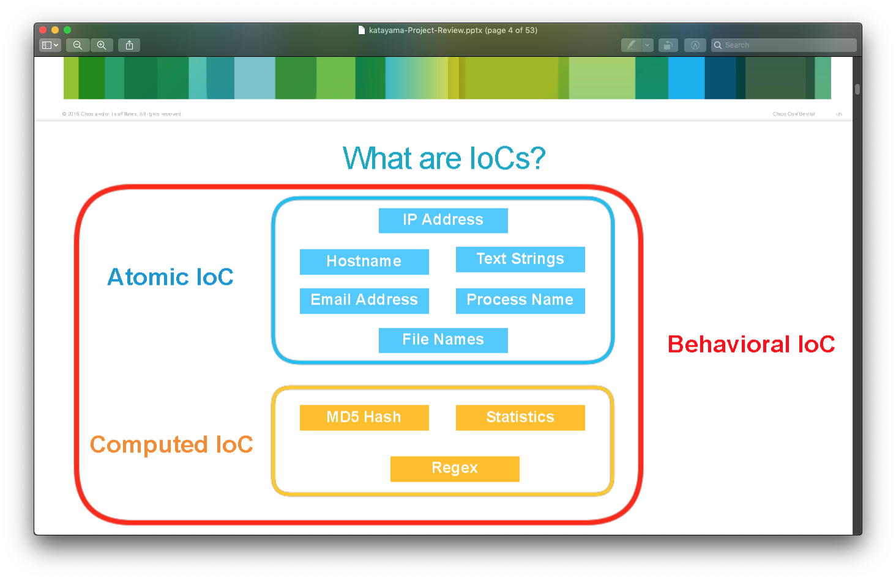
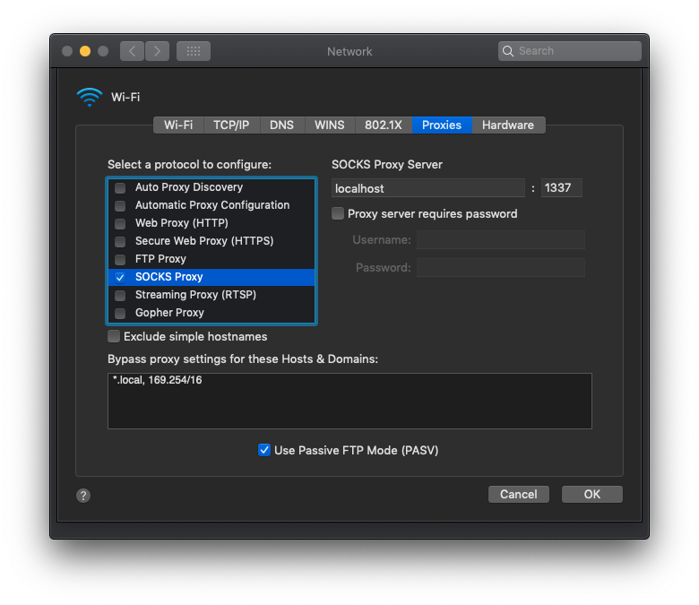
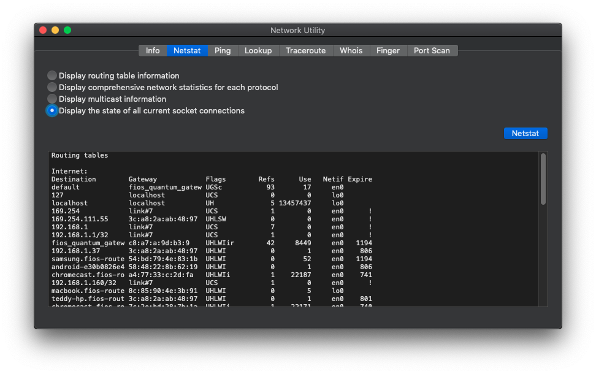
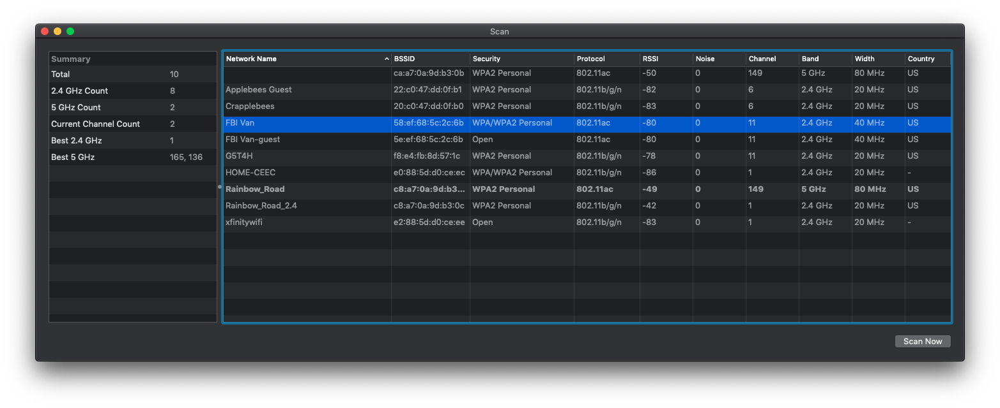
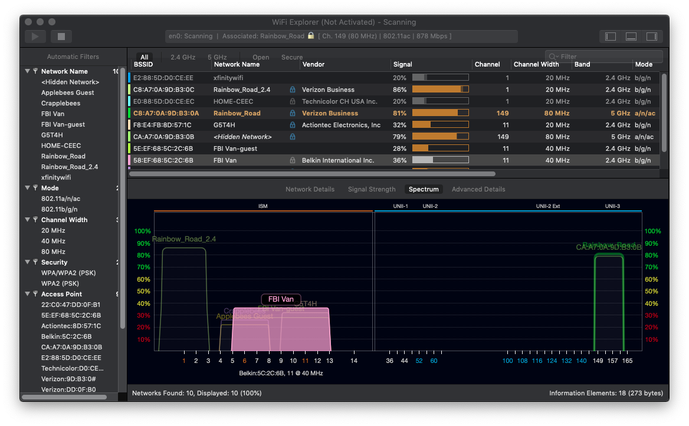

#Applied Network Security
## APT Kill Chain


## IoC

#Quick Tunnel to Hide Traffic
```bash
ssh -D 1337 -f -C -q -N guest@sokotaro.hopto.org -p 42286
```


#Vulnerability Scanners
##openvas
[]()

##nessus
[https://www.tenable.com/products/nessus/nessus-plugins/thank-you-for-registering](https://www.tenable.com/products/nessus/nessus-plugins/thank-you-for-registering)

#Network Scanners
##Network Utility


##Wireless Diagnostics


##Wireless Explorer (external)
[https://en.wikipedia.org/wiki/WiFi_Explorer](https://en.wikipedia.org/wiki/WiFi_Explorer)


##dnsmap
[https://tools.kali.org/information-gathering/dnsmap](https://tools.kali.org/information-gathering/dnsmap)

```bash
$ dnsmap udel.edu    
dnsmap 0.30 - DNS Network Mapper by pagvac (gnucitizen.org)

[+] searching (sub)domains for udel.edu using built-in wordlist
[+] using maximum random delay of 10 millisecond(s) between requests

access.udel.edu
IP address #1: 128.175.104.148

ae.udel.edu
IP address #1: 128.175.28.35

ag.udel.edu
IP address #1: 128.175.126.62

be.udel.edu
IP address #1: 128.175.21.180

cas.udel.edu
IP address #1: 128.175.93.73

catalog.udel.edu
IP address #1: 34.230.121.214
IP address #2: 52.3.2.50
IP address #3: 18.204.77.163

ce.udel.edu
IPv6 address #1: 2620:12a:8000::2
IPv6 address #2: 2620:12a:8001::2

ce.udel.edu
IP address #1: 23.185.0.2

chat.udel.edu
IP address #1: 128.175.13.180

directory.udel.edu
IP address #1: 128.175.13.11

ee.udel.edu
IP address #1: 128.175.68.206

events.udel.edu
IP address #1: 199.19.67.172

id.udel.edu
IP address #1: 128.175.60.17

it.udel.edu
IP address #1: 128.175.176.20

jabber.udel.edu
IP address #1: 128.175.13.180

library.udel.edu
IP address #1: 128.175.83.6

localhost.udel.edu
IP address #1: 127.0.0.1
[+] warning: domain might be vulnerable to "same site" scripting (http://snipurl.com/etbcv)

m.udel.edu
IP address #1: 54.173.165.192
IP address #2: 52.72.241.194

mail.udel.edu
IP address #1: 128.175.68.17

me.udel.edu
IPv6 address #1: 2620:12a:8001::4
IPv6 address #2: 2620:12a:8000::4

me.udel.edu
IP address #1: 23.185.0.4

news.udel.edu
IP address #1: 128.175.13.59

ntp.udel.edu
IP address #1: 128.4.31.12
IP address #2: 128.4.31.10

online.udel.edu
IP address #1: 18.216.251.150

research.udel.edu
IPv6 address #1: 2620:12a:8000::2
IPv6 address #2: 2620:12a:8001::2

research.udel.edu
IP address #1: 23.185.0.2

smtp.udel.edu
IP address #1: 128.175.68.17

sun.udel.edu
IP address #1: 128.175.13.74

vm.udel.edu
IP address #1: 128.175.13.92

webct.udel.edu
IP address #1: 128.175.13.173

webmail.udel.edu
IP address #1: 128.175.13.66

win.udel.edu
IP address #1: 128.175.60.127
IP address #2: 10.2.4.111
[+] warning: internal IP address disclosed
IP address #3: 10.2.7.204
[+] warning: internal IP address disclosed
IP address #4: 128.175.56.28

wr.udel.edu
IP address #1: 128.175.93.57

www.udel.edu
IP address #1: 52.72.241.194
IP address #2: 54.173.165.192

www1.udel.edu
IP address #1: 128.175.13.66

www2.udel.edu
IP address #1: 128.175.176.20

[+] 36 (sub)domains and 47 IP address(es) found
[+] 2 internal IP address(es) disclosed
[+] completion time: 43 second(s)

```

##nmap

```bash
nmap -sS -A -o lan_specs 192.168.1.0/24
```

```
db_nmap -sS -Pn -A 192.168.0.120
```

##tcpdump
```
capture: 
sudo tcpdump -i en0 -s 0 -B 524288 -w dump.pcap
or
sudo tcpdump -Ii en0 -vA -w dump.pcap
or
sudo tcpdump -i en0 -C 1 -z gzip -w ~/tests/tcpdump/`date "+%Y-%m-%d_%H:%M:%S"'+%s'`.pcap
```

```
read:
tcpdump -s 0 -n -e -x -vvv -r dump.pcap
or
tcpdump -nr data.pca
```
